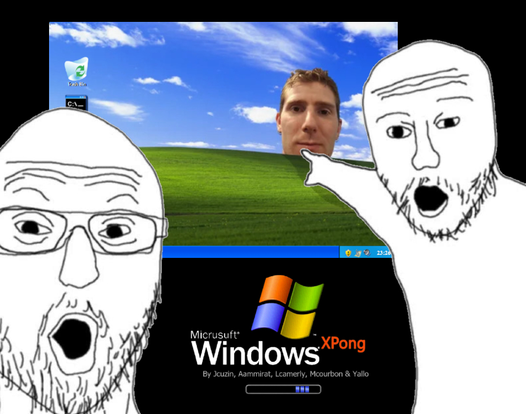

# 🖥️ ft_transcendance (Windows XPong) 🖥️

<div align="center">


*A nostalgic web-based multiplayer Pong game with modern features*

[](https://42.fr/)
</div>

## 🚀 Welcome to ft_transcendance!

This project is the culmination of the 42 school common core, a **feature-rich multiplayer Pong game** with real-time chat, user profiles, and tournament systems - all wrapped in a delightful Windows XP inspired interface.

---

## 📋 Table of Contents

- [🔍 Overview](#-overview)
- [✨ Features](#-features)
- [💻 Installation](#-installation)
- [🎮 How to Play](#-how-to-play)
- [🧩 Technologies](#-technologies)
- [🛠️ Configuration](#-configuration)
- [👥 Team](#-team)
- [❓ FAQ](#-faq)

---

## 🔍 Overview

**ft_transcendance** transforms the classic Pong game into a modern web application. We've built it using NestJS for the backend, with a PostgreSQL database, and a responsive frontend - all containerized with Docker for easy deployment.

<div align="center">

</div>

## ✨ Features

### 🎮 Game Features
- **Real-time Pong Gameplay** - Experience smooth, responsive gameplay
- **Matchmaking System** - Get paired with players of similar skill levels
- **Tournaments** - Compete in organized tournaments
- **Custom Game Modes** - Change game speed, paddle size, and more!

### 👤 User Features
- **User Authentication** - Secure login with OAuth 2.0
- **Profile Customization** - Avatars, stats, and achievement displays
- **Two-Factor Authentication** - Enhanced account security
- **Friend System** - Add friends and challenge them to matches

### 💬 Social Features
- **Live Chat** - Public chat rooms and private messaging
- **Game Spectating** - Watch ongoing matches
- **Leaderboards** - See who ranks highest

<div align="center">

</div>

## 💻 Installation

```bash
# Clone the repository
git clone https://github.com/yourusername/ft_transcendance.git

# Navigate to project directory
cd ft_transcendance

# Start the application using Docker Compose
docker-compose up --build
```

Then visit `http://localhost:3000` in your browser!

<div align="center">

</div>

## 🎮 How to Play

1. **Create an Account** - Sign up or login through OAuth
2. **Find a Match** - Use quick play or challenge a friend
3. **Play the Game** - Control your paddle with mouse or keyboard
4. **Chat & Connect** - Engage with other players in the chat

<div align="center">

</div>

## 🧩 Technologies

- **Backend**: NestJS
- **Frontend**: React or Vue.js
- **Database**: PostgreSQL
- **Real-time Communication**: Socket.io
- **Authentication**: OAuth 2.0
- **Containerization**: Docker & Docker Compose

<div align="center">

</div>

## 🛠️ Configuration

The application can be configured through environment variables in the `.env` file:

```
# Server Configuration
PORT=3000
NODE_ENV=development

# Database Configuration
POSTGRES_USER=postgres
POSTGRES_PASSWORD=password
POSTGRES_DB=transcendance

# OAuth Configuration
OAUTH_CLIENT_ID=your_client_id
OAUTH_CLIENT_SECRET=your_client_secret
```

<div align="center">

</div>

## 👥 Team

This project was created with love by:
- [Team Member 1](https://github.com/username1)
- [Team Member 2](https://github.com/username2)
- [Team Member 3](https://github.com/username3)

<div align="center">

</div>

## ❓ FAQ

**Q: Is my data secure?**  
A: Yes! We use industry-standard encryption and offer 2FA for added security.

**Q: Can I play on mobile?**  
A: Absolutely! Our responsive design works on all devices.

**Q: How is matchmaking determined?**  
A: Players are matched based on skill level determined by win/loss ratios.

---

<div align="center">
<p>© 2023 ft_transcendance Team | <a href="https://github.com/yourusername/ft_transcendance">GitHub Repository</a></p>


*You've just experienced a blast from the past with our Windows XP-themed README!*
</div>