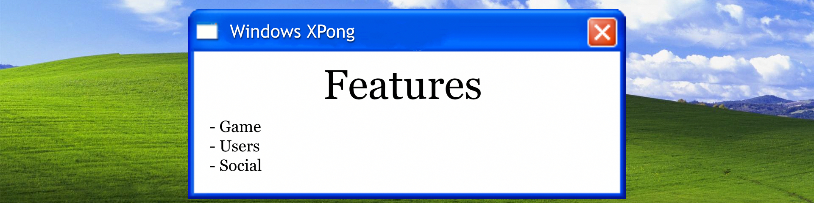
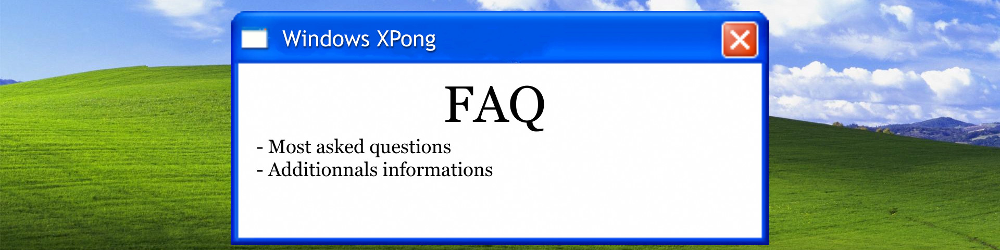

# 🖥️ ft_transcendance (Windows XPong) 🖥️

<div align="center">


*A nostalgic web-based multiplayer Pong game with modern features*

[](https://42.fr/)
</div>

## 🚀 Welcome to ft_transcendance!

This project is the culmination of the 42 school common core, a **feature-rich multiplayer Pong game** with real-time chat, user profiles, and tournament systems - all wrapped in a delightful Windows XP inspired interface.

---

## 📋 Table of Contents

- [🔍 Overview](#-overview)
- [✨ Features](#-features)
- [💻 Installation](#-installation)
- [🎮 How to Play](#-how-to-play)
- [🧩 Technologies](#-technologies)
- [🛠️ Configuration](#-configuration)
- [👥 Team](#-team)
- [❓ FAQ](#-faq)

---

## 🔍 Overview

**ft_transcendance** transforms the classic Pong game into a modern web application. We've built it using NestJS for the backend, with a PostgreSQL database, and a responsive frontend - all containerized with Docker for easy deployment.

<div align="center">

</div>

## ✨ Features

### 🪟 Windows XP Interface System

Our application recreates the nostalgic Windows XP experience with:

- **Authentic Desktop Environment** - Complete with start menu, taskbar, and desktop icons


- **Window Management** - Drag, resize, minimize, and close windows just like the classic OS


- **Start Menu Navigation** - Access all game features through the iconic Windows XP start menu


- **System Notifications** - Receive alerts through authentic XP-style notification bubbles


- **Visual Authenticity** - Carefully recreated XP visual elements including buttons, windows, and cursors


<div align="center">
<p><em>Windows XPong in action - Experience the nostalgic XP interface with modern web technologies</em></p>
</div>


### 🎮 Game Features
- **Real-time Pong Gameplay** - Experience smooth, responsive gameplay
- **Ranked Mode** - Climb the competitive ladder with skill-based matchmaking
- **AI Opponents** - Challenge our neural network powered AI with adaptive difficulty


- **Tournaments** - Compete in organized tournaments

### 👤 User Features
- **User Authentication** - Secure login and registration, password and username changing


- **Profile Customization** - Customize your avatar and wallpaper


### 💬 Social Features
- **Game Stats** - Watch your games history with stats

- **Friend System** - Add friends and challenge them to matches

<!-- - **Leaderboards** - See who ranks highest -->

<div align="center">

</div>

## 💻 Installation

```bash
# Clone the repository
git clone https://github.com/Axiaaa/ft_transcendance.git

# Navigate to project directory
cd ft_transcendance

# Copy the example file
cp .env_example .env

# Edit with your preferred text editor
nano .env

# Start the application using Docker Compose
make
```

Then visit `https://localhost:443` in your browser!

<div align="center">

</div>

## 🎮 How to Play

1. **Create an Account** - Sign up or login through OAuth
2. **Find a Match** - Use quick play or challenge a friend
3. **Play the Game** - Control your paddle with mouse or keyboard

<div align="center">

</div>

## 🧩 Technologies

<div align="center">
<table>
    <tr>
        <td align="center">
            
            <br />
            <b>NodeJS</b>
            <br />
            <small>Backend Runtime</small>
        </td>
        <td align="center">
            
            <br />
            <b>TypeScript</b>
            <br />
            <small>Frontend Language</small>
        </td>
        <td align="center">
            
            <br />
            <b>BabylonJS</b>
            <br />
            <small>3D Game Engine</small>
        </td>
    </tr>
    <tr>
        <td align="center">
            
            <br />
            <b>SQLite</b>
            <br />
            <small>Database</small>
        </td>
        <td align="center">
            
            <br />
            <b>Docker</b>
            <br />
            <small>Containerization</small>
        </td>
        <td align="center">
            
            <br />
            <b>Docker Compose</b>
            <br />
            <small>Container Orchestration</small>
        </td>
    </tr>
</table>

<p><em>Our tech stack is designed for performance and ease of deployment</em></p>
</div>

<div align="center">

</div>

## 🛠️ Configuration

The application can be configured through environment variables in the `.env` file:

1. **Create your environment file**:
    ```bash
    # Copy the example file
    cp .env_example .env
    
    # Edit with your preferred text editor
    nano .env
    ```

2. **Customize your configuration**:
    For security reasons, we strongly recommend changing the following values:
    - `ELASTIC_PASSWORD` and `KIBANA_PASSWORD`
    - `ENCRYPTION_KEY`
    - `GRAFANA_USER` and `GRAFANA_PASSWORD`
    - `API_USERNAME` and `API_PASSWORD`
    - `DISCORD_WEBHOOK_URL` (if you wish to receive notifications)


## 👥 Team

This project was created with love by:
<div align="center">

<h3>Our Development Team</h3>

<table>
    <tr>
        <td align="center">
            <a href="https://github.com/Ocyn">
            
            <br />
            <sub><b>Jcuzin</b></sub>
            </a>
            <br />
            <sub>🖥️ Windows XP UI/UX Designer</sub>
        </td>
        <td align="center">
            <a href="https://github.com/Axiaaa">
                
                <br />
                <sub><b>Lcamerly</b></sub>
            </a>
            <br />
            <sub>🛠️ Backend & DevOps</sub>
        </td>
        <td align="center">
            <a href="https://github.com/nonomex">
                
                <br />
                <sub><b>Aammirat</b></sub>
            </a>
            <br />
            <sub>🔒 Cybersecurity and API Integration</sub>
        </td>
    </tr>
    <tr>
        <td align="center">
            <a href="https://github.com/mcourbon">
                
                <br />
                <sub><b>Mcourbon</b></sub>
            </a>
            <br />
            <sub>🎮 Pong Game & Tournament Designer</sub>
        </td>
        <td align="center">
            <a href="https://github.com/Sarfoula">
                
                <br />
                <sub><b>Yallo</b></sub>
            </a>
            <br />
            <sub>🤖 AI Opponent & Optimization</sub>
        </td>
    </tr>
</table>

<p><em>Our team worked together to bring this Windows XP nostalgia to life!</em></p>
</div>

<div align="center">

</div>

## ❓ FAQ

**Q: Is my data secure?**  
A: Yes! We use industry-standard encryption for security.

**Q: Can I play on mobile?**  
A: Absolutely! Our responsive design works on all devices.

**Q: How is matchmaking determined?**  
A: Players are matched based on skill level determined by win/loss ratios.

---

<div align="center">
<p>© 2023 ft_transcendance Team | <a href="https://github.com/Axiaaa/ft_transcendance.git">GitHub Repository</a></p>

*You've just experienced a blast from the past with our Windows XP-themed README!*
</div>